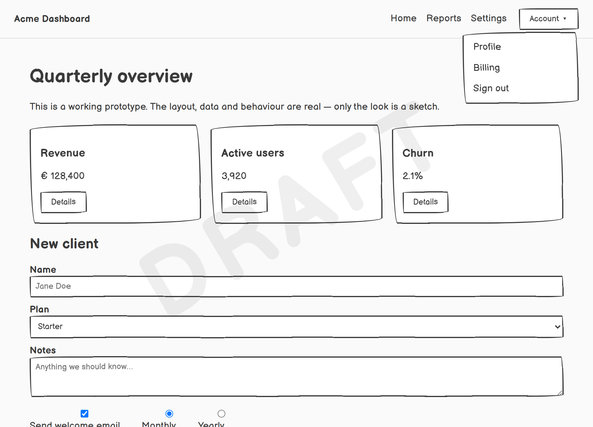
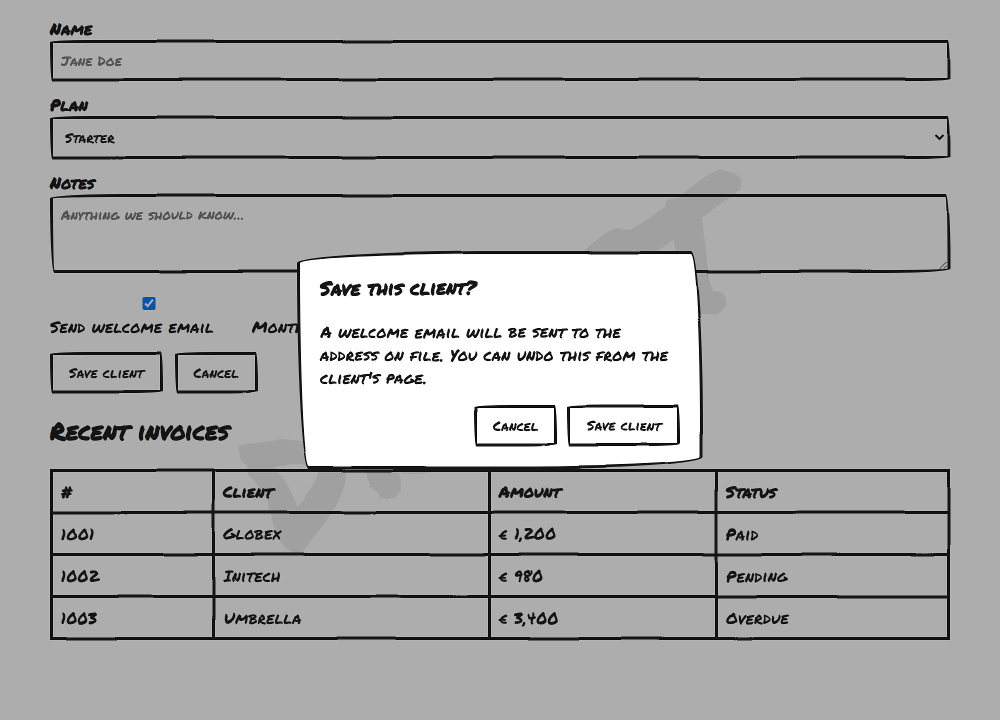
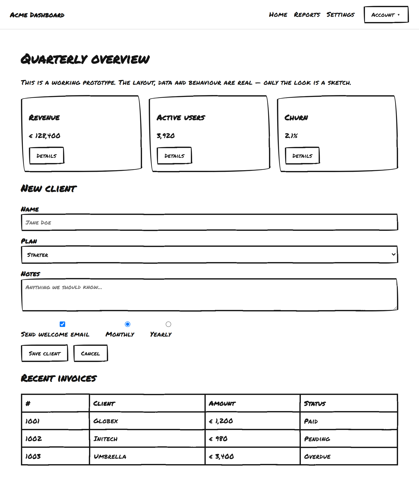
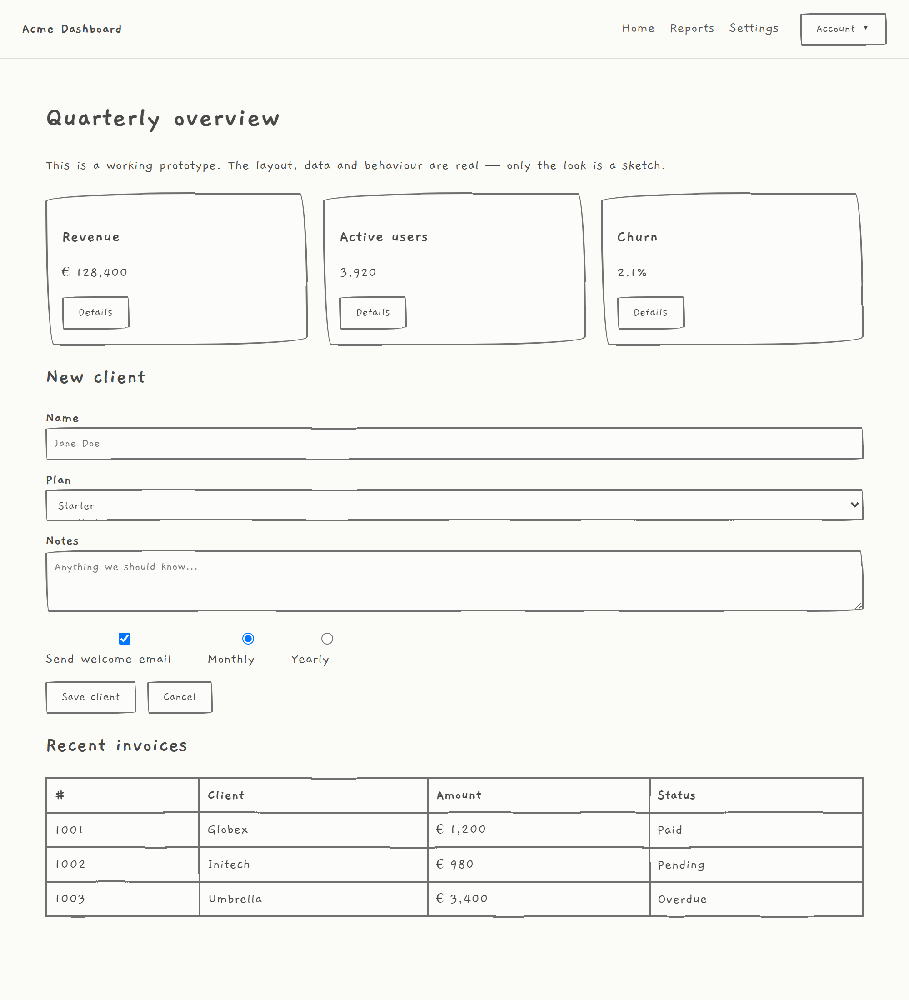
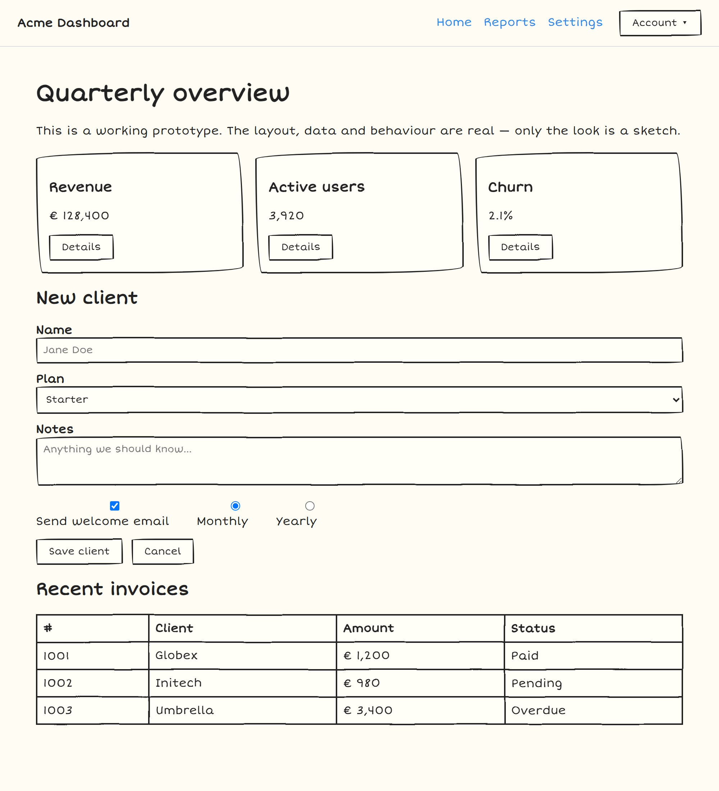
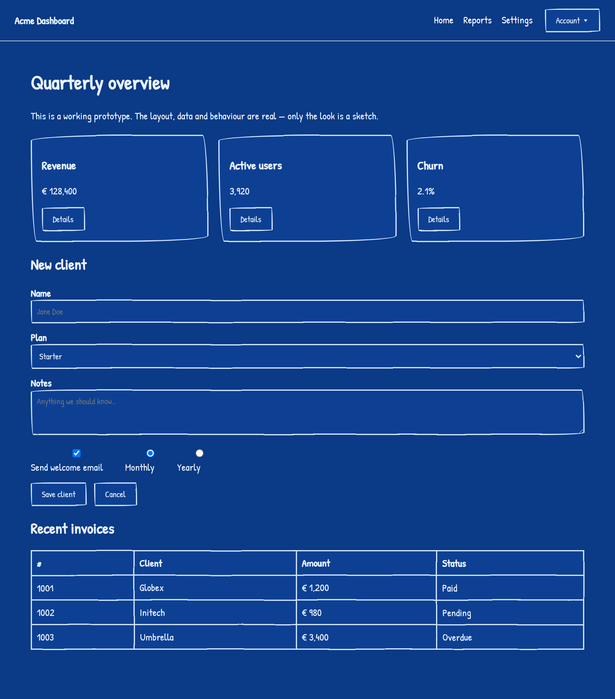
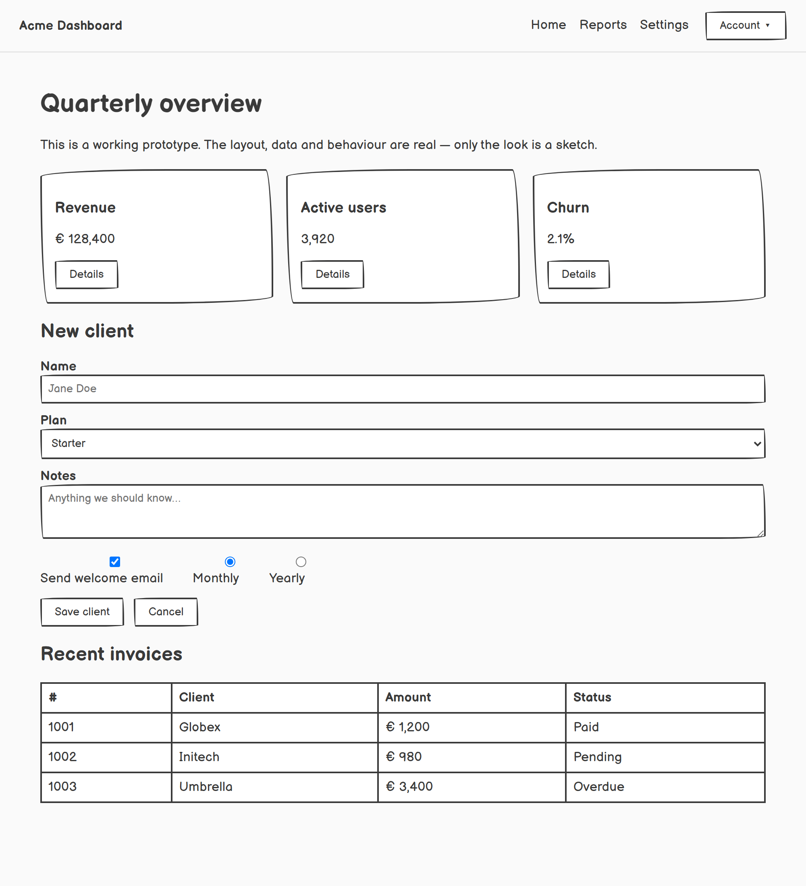
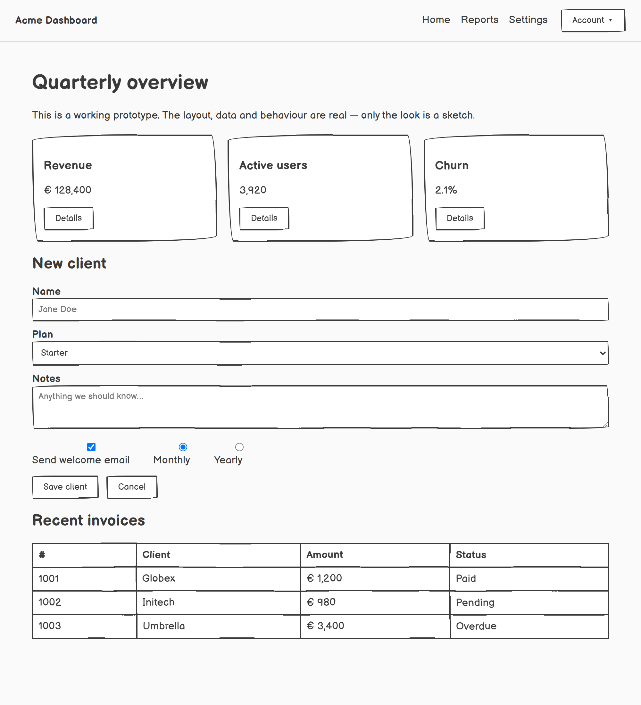
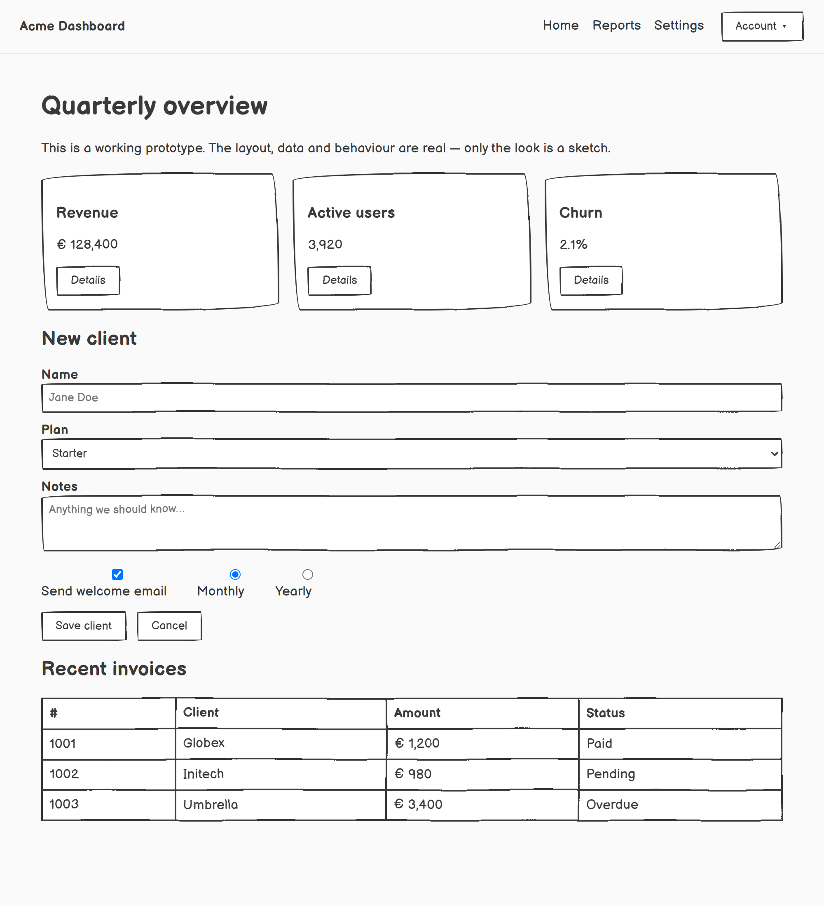

# Prototype Sketching Skill ✏️

[](CHANGELOG.md)
[](SKILL.md)
[](SKILL.md)
[](https://github.com/jovd83/prototype-sketching-skill/actions/workflows/validate.yml)
[](LICENSE)
[](https://buymeacoffee.com/jovd83)

> Make a **working** Angular / React / Vue / static web app **look** hand-sketched
> — so clients instantly understand they are seeing a *prototype*, not the
> finished product, and stop asking "why do you need to rebuild it for production?"

This is an [Agent Skill](https://github.com/agentskills/agentskills) (agentskills.io
standard). It applies a **reversible, non-destructive visual skin**. It changes
**look-and-feel only** — never components, markup, routing, state, or logic.

- 5 sketch styles: **Balsamiq · Sharpie · Pencil · Doodle · Blueprint**
- Adjustable **sketchiness from 0% to 100%**
- Optional **interactive overlay**: radio buttons (OFF + each theme) and a 0–100% slider to toggle live
- Zero runtime dependencies (pure CSS + an inline SVG filter); turn it off by removing two attributes

---

## How it works

Activation is two attributes on `<html>`:

```html
<html data-sketch="balsamiq" data-sketch-level="50">
```

- `data-sketch` — `balsamiq` | `sharpie` | `pencil` | `doodle` | `blueprint`
- `data-sketch-level` — `0` | `25` | `50` | `75` | `100`

The look = handwritten **font swap** + **hand-drawn boxes** (irregular
border-radius, flat fills) + an **SVG displacement filter** whose strength is the
sketchiness level. The filter wobbles box decoration only, so text stays crisp.

See [`SKILL.md`](SKILL.md) for the agent instructions and
[`references/implementation.md`](references/implementation.md) for the details.

---

## Quick start (static HTML)

```html
<head>
  <link rel="stylesheet" href="assets/sketch-skin.css">
</head>
<body>
  <!-- paste assets/sketch-filters.html here, OR just use the overlay script below -->
  ...your app...
  <script src="assets/sketch-toggle.js" defer></script>
</body>
<html data-sketch="balsamiq" data-sketch-level="50">
```

Framework-specific recipes (Angular / React / Vue) are in
[`references/implementation.md`](references/implementation.md).

---

## Interactive overlay

Add one script tag and your client gets a floating control panel — **OFF + one
radio per theme**, a **0–100% sketchiness slider**, and a **watermark text
field** — that switches the look live, with the choice remembered across reloads:

```html
<script src="assets/sketch-toggle.js" defer></script>
```

It auto-injects the SVG filters and only flips the `<html>` attributes, so it is
just as non-destructive as the static approach. Remove the tag to disable.

---

## Diagonal watermark

Stamp the whole screen as a draft with a third `<html>` attribute:

```html
<html data-sketch="balsamiq" data-sketch-level="50" data-sketch-watermark="DRAFT">
```

`data-sketch-watermark` paints one faint, hand-lettered word diagonally across
the viewport. It is fixed and non-interactive (`pointer-events: none`), so it
never blocks clicks or shifts layout. Any text works; remove the attribute to
turn it off, or set it live from the overlay's **Watermark** field.



---

## Modals, popups & SPA navigation

Because the skin is activated on `<html>` with global `[data-sketch] …`
selectors, anything that appears **after** activation inherits it automatically —
dialogs, popovers, dropdown menus, tooltips and toasts (including portal-mounted
ones, with a styled native `::backdrop`), and every screen you navigate to in a
single-page app. Nothing to wire per component or per route. The overlay also
re-injects the SVG filters if a framework swaps out `<body>` on navigation, so
the wobble never silently drops.



---

## Sketch styles

> The five styles, each at 50% sketchiness.

| Balsamiq | Sharpie | Pencil |
|---|---|---|
|  |  |  |

| Doodle | Blueprint |
|---|---|
|  |  |

---

## Sketchiness levels (Balsamiq)

| 0% | 25% | 50% |
|---|---|---|
|  |  |  |

| 75% | 100% |
|---|---|
|  |  |

At **0%** the lines are steady (cleanest wireframe); at **100%** they are very
shaky (maximum "scribble"). The level just selects a stronger SVG displacement
filter.

---

## About the gallery images

The PNGs above live in [`demo/screenshots/`](demo/screenshots/). They are
pre-rendered; the interactive demo app and the Playwright capture script that
produce them are kept in the project's development source and are **not** bundled
in this skill — the skill itself has no build step and no dependencies.

---

## What it never touches

Components · templates · `.ts/.tsx/.jsx/.vue` logic · routing · state · services ·
tests · build config. It only appends a stylesheet, (optionally) one SVG block or
script, and sets two `<html>` attributes. Reverting = remove the attributes.

---

## Repository layout

Everything you need is `assets/` (the skin) plus `SKILL.md` / `references/`. The
`demo/screenshots/` folder only holds the gallery images shown above.

```
prototype-sketching-skill/
├── SKILL.md                      # agent instructions
├── README.md
├── CHANGELOG.md
├── references/
│   ├── styles.md                 # per-style spec + how to add a style
│   └── implementation.md         # framework recipes, SVG math, offline fonts, revert
├── assets/                       # ← the skin (this is what you copy into an app)
│   ├── sketch-skin.css           # the skin (all styles + sketchiness ramp)
│   ├── sketch-filters.html       # SVG wobble filters (static injection)
│   ├── sketch-toggle.js          # optional interactive overlay
│   └── fonts/README.md           # self-hosting fonts offline
└── demo/
    └── screenshots/              # gallery images used by this README
```

## Credits & technique

- SVG rough-border technique: feTurbulence + feDisplacementMap
  ([bengammon](https://bengammon.co.uk/rough-css-borders-with-svg-filters/),
  [Camillo Visini](https://camillovisini.com/coding/simulating-hand-drawn-motion-with-svg-filters),
  [MDN](https://developer.mozilla.org/en-US/docs/Web/SVG/Reference/Element/feTurbulence))
- [Balsamiq Sans](https://balsamiq.com/givingback/opensource/font/) and the
  other fonts are SIL Open Font License.
- Inspiration: [DoodleCSS](https://github.com/chr15m/DoodleCSS),
  [Wired Elements](https://wiredjs.com/) (component-swap approach — deliberately
  **not** used here because it edits markup).

## License

MIT (skin/code). Fonts under their respective SIL Open Font Licenses.
